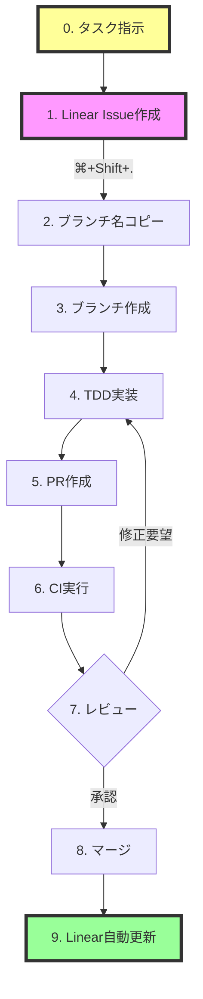

# Linear × GitHub × Claude Code ワークフロー仕様書

## 1. 役割分担表

| 役割 | 担当 | 主な責務 | 使用ツール |
|------|------|----------|------------|
| **プロダクトオーナー** | あなた（人間） | • タスクの指示と方向性決定 • 最終的な品質承認 • リリース判断 | チャット, Linear |
| **タスク管理システム** | Linear | • Issue/タスクの一元管理 • ステータスの自動追跡 • プロジェクト進捗の可視化 | Linear App |
| **開発実行者** | Claude Code（私） | • Linear Issue作成 • テスト作成 • 機能実装 • リファクタリング • PR作成 | VS Code, Git, npm, Linear API |
| **コード管理** | GitHub | • ソースコード管理 • PR/レビュープロセス • CI/CD実行 | GitHub Actions |

## 2. 開発サイクル概要

## 3. 詳細ワークフロー

### フェーズ1: 計画（Linear）
**担当**: あなた（人間）→ Claude Code（私）
- あなたがタスクを指示
- Claude Code が Linear Issue を自動作成
- 要件、受け入れ基準を整理して記載
- 優先度とラベルを設定

### フェーズ2: 開発準備（Linear → GitHub）
**担当**: Claude Code（私）
1. Linear Issue から `⌘+Shift+.` でブランチ名をコピー
2. `git checkout -b [ブランチ名]` で新規ブランチ作成
3. Linear ステータス: Backlog → In Progress（自動）

### フェーズ3: 実装（Claude Code）
**担当**: Claude Code（私）
1. **Red**: 失敗するテストを書く
2. **Green**: テストをパスする最小限の実装
3. **Refactor**: コードの品質向上
4. コミット & プッシュ

### フェーズ4: レビュー（GitHub）
**担当**: あなた（人間）+ CI
1. PR作成（Claude Code）
2. CI自動実行（GitHub Actions）
3. コードレビュー（人間/Claude）
4. 修正対応（Claude Code）

### フェーズ5: 完了（GitHub → Linear）
**担当**: システム（自動）
1. PRマージ（人間承認）
2. Linear ステータス: In Progress → Done（自動）
3. ブランチ削除（自動）

## 4. 各ツールの連携ポイント

### Linear ↔ GitHub
- **Issue同期**: Linear Issue と GitHub Issue/PR の双方向同期
- **ステータス連動**: PR状態に応じたLinearステータスの自動更新
- **リンク**: コミットメッセージにIssue IDを含めることで自動リンク

### GitHub ↔ Claude Code
- **PR作成**: `gh pr create` コマンドで自動化
- **コード生成**: Claude Code Action による自動実装
- **レビュー**: `@claude` メンションでコードレビュー依頼

### Linear ↔ Claude Code
- **MCP連携**: `mcp__linear__*` ツールでLinear APIに直接アクセス
- **Issue作成/更新**: Claude から直接Linear操作が可能
- **ステータス確認**: リアルタイムでの進捗把握

## 5. 自動化のメリット

| 項目 | 従来の方法 | 新しい方法 | 削減時間 |
|------|-----------|-----------|----------|
| Issue管理 | Linear + GitHub 二重入力 | Linear のみ | 5分/Issue |
| ブランチ作成 | 手動で命名規則を確認 | ⌘+Shift+. でコピー | 2分/回 |
| 実装 | 全て手動コーディング | Claude Code が支援 | 30-60分/機能 |
| ステータス更新 | 手動で都度更新 | 完全自動 | 3分/回 |
| PR作成 | ブラウザで操作 | CLIで自動 | 5分/PR |

**推定効率化**: 1機能あたり 45-75分 の削減

## 6. 運用上の注意点

### DO ✅
- Linear の Issue に詳細な要件を記載
- コミットメッセージに Issue ID を含める
- PR には Linear Issue へのリンクを追加
- テストを必ず先に書く（TDD）

### DON'T ❌
- GitHub で直接 Issue を作成しない
- Linear のステータスを手動で変更しない
- PR タイトルから Issue ID を削除しない
- テストなしでマージしない

## 7. トラブルシューティング

| 問題 | 原因 | 解決方法 |
|------|------|----------|
| Linearステータスが更新されない | GitHub連携が切れている | Linear設定でGitHub連携を再認証 |
| Claude Code Reviewエラー | API制限/設定ミス | GitHub App設定を確認 |
| CI失敗 | 依存関係/環境差異 | package-lock.jsonを更新 |

## 8. 今後の改善提案

1. **自動デプロイ**: mainマージ後の自動デプロイ設定
2. **通知統合**: SlackへのLinear/GitHub通知連携
3. **メトリクス**: 開発速度・品質指標の自動収集
4. **テンプレート**: Issue/PRテンプレートの標準化

---

作成日: 2025-07-02
作成者: Claude Code + hamaup
バージョン: 1.0